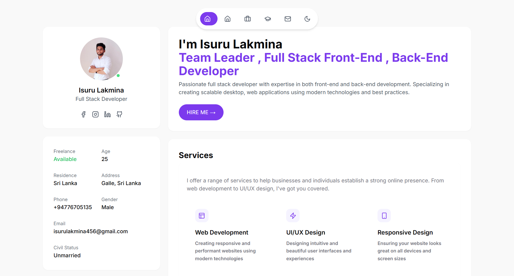

# ✨ Modern Portfolio Website

> **⚠️ IMPORTANT NOTICE: Code downloading/usage is prohibited. If you want to use this code, please contact the author directly at isurulakmina456@gmail.com**

## 🚀 Overview

A sleek and modern portfolio website built with Next.js, TailwindCSS, and TypeScript. This responsive portfolio template showcases professional skills, projects, education, and contact information with an elegant user interface and smooth animations.

The live version of this portfolio is available at: [https://isurulakmina.vercel.app/](https://isurulakmina.vercel.app/)

## ✨ Features

- 🎨 **Modern UI/UX**: Clean, beautiful interface with smooth animations
- 🌙 **Dark/Light Mode**: Toggle between light and dark themes
- 📱 **Fully Responsive**: Looks great on all devices (mobile, tablet, desktop)
- 🧩 **Modular Components**: Well-organized React components for easy customization
- 📊 **Skills Section**: Visual representation of technical skills and proficiency
- 💼 **Portfolio Showcase**: Display projects in an attractive grid layout
- 👨‍🎓 **Education Timeline**: Display educational background in a stylish timeline
- 💻 **Work Experience**: Showcase professional experience
- 📝 **Contact Section**: Easy way for visitors to get in touch
- 🚀 **Performance Optimized**: Fast loading and rendering

## 🛠️ Technology Stack

- **Framework**: Next.js 15
- **Language**: TypeScript
- **Styling**: TailwindCSS
- **UI Components**: Radix UI primitives
- **Animations**: Framer Motion
- **Icons**: Lucide React
- **Form Handling**: React Hook Form + Zod validation

## 🚀 Getting Started

### Prerequisites

- Node.js (v16 or higher)
- npm or yarn

## 🔧 Customization

To personalize this portfolio for your own use:

1. Update the personal information in `app/page.tsx`
2. Replace the profile image with your own photo (in the page component)
3. Modify the skills, portfolio projects, experience, and education sections to reflect your background
4. Add your own social media links and contact information
5. Customize the color scheme in `tailwind.config.ts` (currently using purple accents)
6. Update the favicon and metadata in the app layout

## 📱 Responsive Design

The portfolio is fully responsive and optimized for:
- Mobile devices (320px and up)
- Tablets (768px and up)
- Desktops (1024px and up)
- Large screens (1280px and up)

## 🔍 SEO Optimization

This template includes basic SEO best practices to help your portfolio get discovered:
- Semantic HTML structure
- Meta tags and descriptions
- Responsive design (Google mobile-friendly)
- Optimized images

## 📄 License

This project is licensed under the Apache License 2.0 with additional restrictions - see the [LICENSE](LICENSE) file for details.

**Note: Despite the Apache License, the author restricts downloading and usage of this code. If you wish to use any part of this code, you must contact the author directly for permission.**

## 🤝 Contributing

Contributions, issues, and feature requests are welcome! Feel free to check the [issues page](https://github.com/yourusername/Modern_Portfolio_Website/issues).

## 🙏 Acknowledgements

- [Next.js](https://nextjs.org/)
- [TailwindCSS](https://tailwindcss.com/)
- [Radix UI](https://www.radix-ui.com/)
- [Framer Motion](https://www.framer.com/motion/)
- [Lucide Icons](https://lucide.dev/)

---

  
Made with ❤️ by Isuru Lakmina

  

    <a href="https://github.com/lakmina456">GitHub</a> •
    <a href="https://www.linkedin.com/in/isuru-lakmina-0a655720a">LinkedIn</a> •
    <a href="https://www.instagram.com/isurulakmina">Instagram</a>
  

